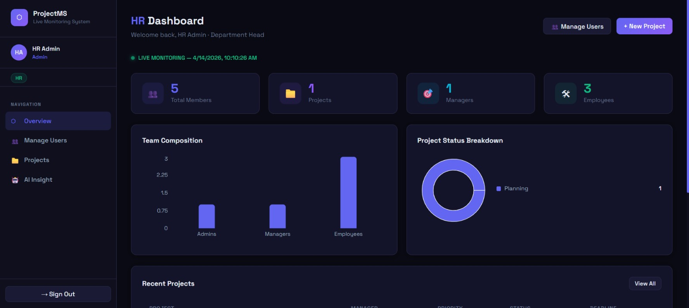
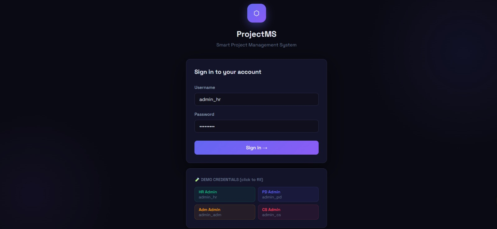
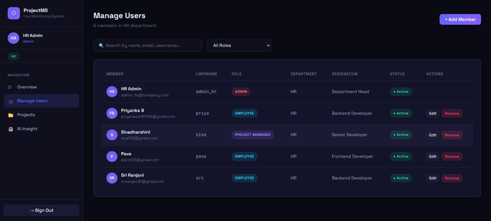
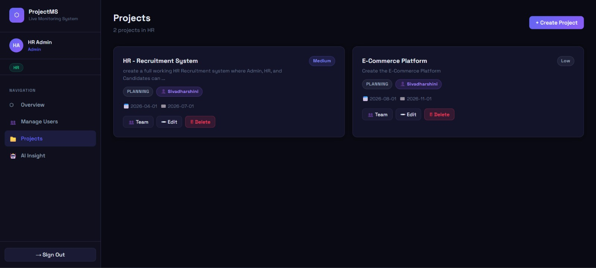
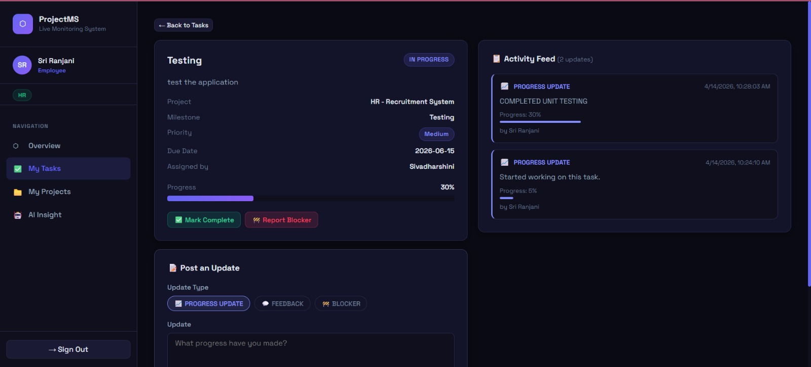
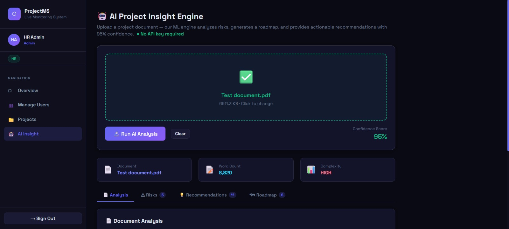

# AI-Driven Smart Project Management System

An intelligent full-stack project management platform built using React, Spring Boot, MongoDB, and Python-based AI modules. The system streamlines project planning, task management, milestone tracking, team collaboration, and project monitoring while providing AI-powered project insights, risk analysis, recommendations, and roadmap generation.

---

## Project Overview

The AI-Driven Smart Project Management System is designed to help organizations efficiently manage projects, teams, tasks, and milestones through a centralized platform. The system integrates Artificial Intelligence to analyze project documents, identify potential risks, generate recommendations, and create actionable project roadmaps.

---

## Key Features

### User & Role Management

* Role-Based Access Control (RBAC)
* Admin, HR, Project Manager, and Employee roles
* Department-wise user management
* User onboarding and access management

### Project Management

* Create and manage projects
* Assign project managers and team members
* Monitor project progress and status
* Department-wise project organization

### Task Management

* Create and assign tasks
* Track task progress and completion
* Task prioritization
* Team collaboration support

### Milestone Tracking

* Create project milestones
* Track milestone completion
* Timeline-based project monitoring
* Progress visualization

### Dashboard & Analytics

* Real-time project monitoring
* Team composition statistics
* Project status analysis
* Department-level insights

### AI-Powered Project Insights

* Document analysis
* Risk assessment generation
* Automated recommendations
* Project complexity analysis
* AI-generated project roadmaps

---

## Technology Stack

### Frontend

* React.js
* JavaScript
* Tailwind CSS
* React Router
* Axios
* Recharts

### Backend

* Spring Boot
* Java
* Spring Security
* REST APIs

### Database

* MongoDB

### AI & Analytics

* Python
* Machine Learning Libraries
* Document Processing Modules
* Risk Analysis Engine
* Recommendation Engine

### Tools

* Git
* GitHub
* Postman

---

## Screenshots

### Dashboard



### Login Page



### Manage Users



### Project Management



### Task Management



### AI Insight Engine



---

## System Architecture

```text
React Frontend
       │
       ▼
 REST APIs
       │
       ▼
Spring Boot Backend
       │
       ▼
   MongoDB
       │
       ▼
 Python AI Engine
       │
       ▼
Risk Analysis • Recommendations • Roadmaps
```

---

## Quick Start

### Backend Setup

```bash
cd backend
mvn spring-boot:run
```

Backend runs at:

```text
http://localhost:8080
```

### Frontend Setup

```bash
cd frontend
npm install
npm start
```

Frontend runs at:

```text
http://localhost:3000
```

---

## Default Login Credentials

| Department          | Username  | Password  | Role  |
| ------------------- | --------- | --------- | ----- |
| HR                  | admin_hr  | Admin@123 | Admin |
| Project Development | admin_pd  | Admin@123 | Admin |
| Administration      | admin_adm | Admin@123 | Admin |
| Cybersecurity       | admin_cs  | Admin@123 | Admin |

Each Admin can create Project Managers and Employees within their respective departments.

---

## Future Enhancements

* Real-time notifications
* Team chat integration
* Cloud deployment
* Mobile application support
* Advanced AI forecasting
* Automated project effort estimation
* Project performance prediction

---

## Author

**Pava**

B.Tech Information Technology

Final Year Project – AI-Driven Smart Project Management System
